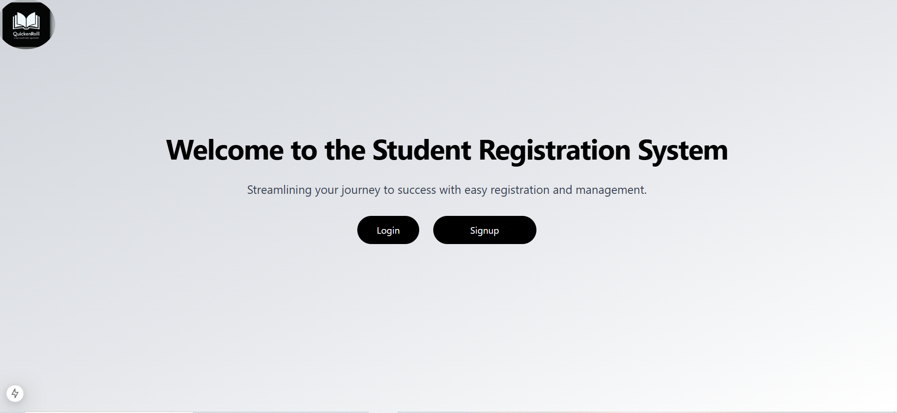
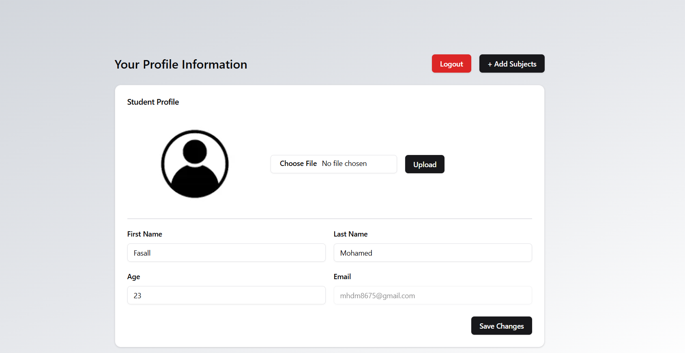

# Student Registration System

## Overview

The **Student Registration System** is a web application designed to facilitate student registration and management. It consists of a **Next.js** frontend and an **Express.js** backend, providing a seamless and efficient user experience.



## Features

- User authentication (Registration & Login)
- Student profile management
- Student profile picture upload
- Admin dashboard for student management
- Secure API endpoints



## Technologies Used

### Frontend (Next.js framwork)

- React & Next.js
- Tailwind CSS (for styling)
- Shadcn UI library (for ui Components)
- Fetch (for API requests)
- zod (for form validation)

### Backend (Express.js)

- Node.js & Express.js
- MongoDB & Mongoose (for database management)
- JWT (for authentication)
- bcrypt (for password hashing)
- dotenv (for environment variables)

## Installation & Setup

### Prerequisites

- Node.js installed
- MongoDB installed or a MongoDB Atlas database

### Backend Setup

1. Clone the repository:
   ```sh
   git clone https://github.com/Fazal-dev/Student-Registration-system.git
   cd student-registration-system/backend
   ```
2. Install dependencies:
   ```sh
   npm install
   ```
3. Create a `.env` file in the `backend` directory and add the following:
   ```env
   PORT=5000
   MONGO_URI=your_mongodb_connection_string
   JWT_SECRET=your_jwt_secret
   ```
4. Start the backend server:
   ```sh
   npm start
   ```

### Frontend Setup

1. Navigate to the frontend folder:
   ```sh
   cd ./frontend
   ```
2. Install dependencies:
   ```sh
   npm install
   ```
3. Start the frontend server:
   ```sh
   npm run dev
   ```

## Running in Production

To run in production, build the frontend and serve it with the backend:

```sh
cd ./frontend
npm run build
npm run export
cd ./backend
npm start
```

## License

This project is licensed under Fazal mohamed
